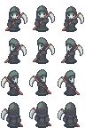
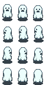
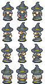
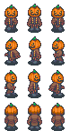

 

# Scary Maze | Project Moonstone #
[Intro to 2D Character Movement - Godot Beginner Tutorial](https://www.youtube.com/watch?v=kw1iI69kW6o) by [Code With Ro](https://codewithro.com/) ([Patreon](https://www.patreon.com/cw/CodeWithRo))

This video tutorial is a beginner-friendly, step-by-step project that guides viewers through building a simple 2D player controller in the Godot Engine using a pixelated sprite. It covers project organization, sprite setup, movement logic, collision body, input handling, camera behavior, and animations to create a fully functional 2D character. The tutorial also served as the foundation for a structured implementation task on Feather, with the project integrated into the broader development workflow of supporting the Handshake AI Project Moonstone initiative.

# Assets #
[Halloween Graphics](https://finalbossblues.itch.io/halloween-graphics) by [Jason Perry](https://finalbossblues.com/) ([Pateron](http://patreon.com/finalbossblues))

# Create a Godot task #
<ins> **Step 1: Context setting** </ins>
 
Please include the following context-setting data about the tutorial and segment you selected.

OS version: Windows 11 Pro

Application version: Godot Engine v4.5.1.stable.official [f62fdbde1]

<ins> Description of the task/project you selected </ins>
 
The selected task focuses on implementing basic 2D player movement in the Godot Engine using an animated character sprite, including keyboard input handling, movement logic, and character control. Development will follow the YouTube tutorial "Intro to 2D Character Movement - Godot Beginner Tutorial" by Code With Ro, using the time segment from approximately 00:16 to 28:40.

- Start Point: https://youtu.be/kw1iI69kW6o?si=H5SCbQFy0Fhqdm27&t=16
- End Point: https://youtu.be/kw1iI69kW6o?si=ZpcuOGbL_V12ZPaD&t=1720

In this segment, the tutorial demonstrates how to implement an animated player character using a PNG sprite sheet in Godot. It covers configuring the necessary scene nodes, setting up collision and physics for the character, defining input actions, writing GDScript for smooth frame-independent movement, and customizing the 2D game environment. The starting state is a new Godot project with a basic empty scene, and the ending state is a playable 2D game scene featuring a fully animated player character that can move in four directions within a gray game environment.

<ins> Briefly describe the inputs to / input state of this project. </ins>
 
The input state consists of a newly created Godot project in which a simple 2D environment gets set up to move an animated Grim Reaper sprite asset from the Halloween Graphics pack created by finalbossblues on itch.io. I will use the "reaper_blade_1.png" image file from the "reaper" folder in the graphics pack as the sole sprite asset for the player character's movement and animation frames in this task. https://finalbossblues.itch.io/halloween-graphics

<ins> **Step 2: Task completion** </ins>
 
Screen recordings and intermediate artifacts.

<ins> Brief description of the breakpoint-1 </ins>
 
Following a YouTube video tutorial, I created a new Godot project named "Tutorial," organized it with assets, scenes, and scripts folders, and imported the "reaper_blade_1.png" image from the Halloween Graphics pack as the first animated asset. I then created a 2D game scene and a separate player scene, added a "CharacterBody2D" node with an "AnimatedSprite2D" child node, and configured the sprite sheet as a 3×4 grid to define the initial "idle_down" animation frame. To improve visual clarity, I changed the project's default texture filter to "Nearest," centered the sprite in the 2D environment, and positioned it above the y-axis to establish the character sprite's starting point.

<ins> Brief description of the breakpoint-2 </ins>
 
Continuing the YouTube video tutorial, I added three directional idle animation frames to the sprite asset, named them "idle_left," "idle_right," and "idle_up," and selected the appropriate idle sprites from the sprite sheet grid. I then created walking animations by adding four frames named "walk_down," "walk_left," "walk_right," and "walk_up," each using three sprites from the sheet grid to animate directional movement. Finally, I added a "CollisionShape2D" child node to the "Player" node and selected a "CircleShape2D" collision area for the sprite's body, and then dragged the "player.tscn" scene into the center of the 2D game scene.

<ins> Brief description of the breakpoint-3 </ins>
 
Following the video tutorial, I added a camera to the game scene by configuring a "Camera2D" child node and adjusting its zoom for better visibility of the sprite asset in the 2D environment. I then defined keyboard input actions for directional movement by navigating to Input Map within Project Settings, and added new actions named "move_down," "move_up," "move_left," and "move_right" and assigned them to keybinds using "S," "W," "A," and "D." Finally, I programmed a GDScript to the "Player" node and implemented the core movement logic, utilizing variables for speed and direction, and using a "_physics_process(delta)" function for smooth movement and collision handling.

<ins> Brief description of the breakpoint-4 </ins>
 
Finishing the video tutorial, I debugged an issue where the sprite asset kept moving after releasing the input key by using print statements to track direction variables and adding a new "play_idle_animation" function to handle the sprite's idle state when it's not moving. I also discovered that the idle animation was incorrectly using the current direction instead of "last_direction," so I quickly fixed this issue by adding an else statement in the "_physics_process(delta)" function that calls a "play_idle_animation" function. After resolving the bugs, I unparented the "Camera2D" node to observe the sprite's movement and adjusted the "max_speed" variable to show its effect on the sprite's movement speed.

<ins> **Step 3: Task specification** </ins>
 
Prompt reference file(s).

<ins> Reference link/description </ins>
 
Intro to 2D Character Movement - Godot Beginner Tutorial by [Code With Ro](https://www.youtube.com/@CodeWithRo): https://www.youtube.com/watch?v=kw1iI69kW6o

<ins> Reference link/description </ins>
 
Grim Reaper Sprite Asset from the Halloween Graphics Pack by [finalbossblues](https://finalbossblues.itch.io/): https://finalbossblues.itch.io/halloween-graphics

<ins> Final Prompt </ins>
 
Create a playable 2D scene environment with a resolution of 1152 x 648 in the Godot Engine, featuring a controllable player character using an animated sprite. The project should depict a small pixelated sprite of a grim reaper carrying a scythe as the sole character asset, displayed clearly without texture blurring in a 2D scene with a background color of #4d4d4d. The player character must move smoothly in four directions using the W, A, S, and D keys, play the correct walking animation while moving in each direction, and switch to a direction-specific idle animation when movement stops. Each movement direction must use its own distinct walking animation, and each idle state must use its own distinct idle animation for up, left, right, and down. When the input key is released, the player character must immediately stop and face the last direction moved, with distinct idle animations for up, left, right, and down. In the Input Map settings, there must be input actions with keybindings named "move_up" mapped to W, "move_left" mapped to A, "move_right" mapped to D, and "move_down" mapped to S. The player character should move to the left when pressing the A key, the player character should move to the right when pressing the D key, the player character should move up when pressing the W key, and the player character should move down when pressing the S key. The player character must use a 2D circle collision shape area to provide physics-based collision handling that supports smooth, controlled 2D movement, along with programmed animation logic that clearly distinguishes between idle and walking states for each movement direction. Use a camera node to display the character player in the center of the scene, and ensure the movement speed is adjustable through a configurable variable named "max_speed" in the GDScript code. The final result should be a responsive 2D player movement system that demonstrates animation structure, input handling, collision setup, and real-time movement behavior within Godot.

<ins> Rubric Items </ins>
 
1. The playable game is a 2D scene environment.
- Open the game scene and confirm that it uses a type "Node2D" node to view the scene in the 2D editor.
- The prompt requires that the project include a playable 2D game scene that serves as the primary gameplay environment.

2. The project's viewport width is 1152.
- Verify that the Viewport Width value is equal to 1152 by navigating to "Project Settings," then "Display," and then "Window."
- The prompt requires that the project's resolution be 1152 x 648. Because these values are adjustable individually, each should be eligible for partial credit.

3. The project's viewpoint height is 648.
- Verify that the Viewport Height value is equal to 648 by navigating to "Project Settings," then "Display," and then "Window."
- The prompt requires that the project's resolution be 1152 x 648. Because these values are adjustable individually, each should be eligible for partial credit.

4. The scene's background color is colored to #4d4d4d.
- Confirm that the Default Clear Color hex value is equal to #4d4d4d by clicking on "Project Settings," then "Rendering," and then "Environment."
- The prompt requires that the scene background must use the color code #4d4d4d.

5. The sprite asset uses a small pixelated Grim Reaper carrying a scythe.
- Run the game scene and visually confirm that only the pixelated Grim Reaper sprite is visible as the player character.
- The prompt requires that the correct sprite asset of a grim reaper carrying a scythe must be the only player character for the project.

6. The sprite asset renders without any blurry texture.
- Confirm that the Default Texture Filter is assigned to "Nearest" by clicking on "Project Settings," then "Rendering," and then "Textures."
- The prompt requires that the sprite asset have a clearly visible pixel-art texture.

7. Pressing W on the keyboard moves the character sprite upward.
- Run the game scene and then press the W key to verify that the player character moves upward.
- Pressing the W key should cause the sprite asset to move up, as required by the prompt.

8. Pressing A on the keyboard moves the character sprite to the left.
- Run the game scene and then press the A key to verify that the player character moves left.
- Pressing the A key should cause the sprite asset to move left, as required by the prompt.

9. Pressing D on the keyboard moves the character sprite to the right.
- Run the game scene and then press the D key to observe the right movement direction.
- Pressing the D key should cause the sprite asset to move right, as required by the prompt.

10. Pressing S on the keyboard moves the character sprite downward.
- Run the game scene and then press the S key to observe the downward movement direction.
- Pressing the S key should cause the sprite asset to move down, as required by the prompt.

11. The character sprite stops moving immediately when input is released.
- Run the game scene, press any movement key, then release the movement key, and observe whether movement ceases instantly.
- The prompt requires that the character sprite stop moving immediately when any pressed input key is released.

12. The idle animation faces up after the upward movement stops.
- Run the game scene, move the player character upward, release the W input key, and inspect the idle animation facing direction.
- The prompt requires the character sprite to face up as the last movement direction when the upward input is released.

13. The idle animation faces left after the leftward movement stops.
- Run the game scene, move the player character left, release the A input key, and inspect the idle animation facing direction.
- The prompt requires the character sprite to face left as the last movement direction when the leftward input is released.

14. The idle animation faces right after the rightward movement stops.
- Run the game scene, move the player right with the D key, release the key, and verify that the idle animation faces right.
- The prompt requires the character sprite to face right as the last movement direction when the rightward input is released.

15. The idle animation faces down after the downward movement stops.
- Run the game scene, move the player character downward, release the S input key, and inspect the idle animation facing direction.
- The prompt requires the character sprite to face down as the last movement direction when the downward input is released.

16. The sprite triggers upward-walking animations while moving up.
- Run the game scene, press and hold the W key, and inspect that the player character's walking animation moves upward.
- The prompt requires that the upward walking animations transition appropriately when the player character moves up.

17. The sprite triggers leftward-walking animations while moving left.
- Run the game scene, press and hold the A key, and inspect that the player character's walking animation moves leftward.
- The prompt requires that the leftward walking animations transition smoothly when the player character moves left.

18. The sprite triggers rightward-walking animations while moving right.
- Run the game scene, press and hold the D key, and inspect that the player character's walking animation moves rightward.
- The prompt requires that the rightward walking animations transition smoothly when the player character moves right.

19. The sprite triggers downward-walking animations while moving down.
- Run the game scene, press and hold the S key, and inspect that the player character's walking animation moves downward.
- The prompt requires that the downward walking animations transition smoothly when the player character moves down.

20. The player character has a 2D collision circle area enabled.
- Open the player scene and verify that it uses a "CollisionShape2D" node with a circular shape for 2D physics collisions.
- The prompt requires that the player character include appropriate physics and collision handling to support controlled movement.

21. A camera node is present that displays the sprite in the scene's center.
- Open the game scene and confirm that it uses a type "Camera2D" node to display the character sprite in the center of the 2D scene.
- The prompt requires that the game scene have a camera node to display the player character at the center of the environment.

22. The sprite's movement speed is adjustable by a configurable variable.
- Inspect the GDScript code for a modifiable "max_speed" variable affecting the movement speed of the sprite.
- The prompt requires that the GDScript code have an adjustable movement speed through a modifiable variable.

23. The Input Map includes a "move_up" action bound to the W key.
- Verify an action exists with the W key assigned by navigating to "Project Settings" and then to "Input Map" to see the "Action" list.
- The prompt requires that the W key be assigned as a keyboard input action to control the player character.

24. The Input Map includes a "move_left" action bound to the A key.
- Verify an action exists with the A key assigned by navigating to "Project Settings" and then to "Input Map" to see the "Action" list.
- The prompt requires that the A key be assigned as a keyboard input action to control the player character.

25. The Input Map includes a "move_right" action bound to the D key.
- Verify an action exists with the D key assigned by navigating to "Project Settings" and then to "Input Map" to see the "Action" list.
- The prompt requires that the D key be assigned as a keyboard input action to control the player character.

26. The Input Map includes a "move_down" action bound to the S key.
- Verify an action exists with the S key assigned by navigating to "Project Settings" and then to "Input Map" to see the "Action" list.
- The prompt requires that the S key be assigned as a keyboard input action to control the player character.
 
Godot - Full Vertical Slice (Game Prototype) - Finished prompt creation.

---

# Scary Maze | Project Touchstone #
[Intro to 2D Character Movement - Godot Beginner Tutorial](https://www.youtube.com/watch?v=kw1iI69kW6o) by [Code With Ro](https://codewithro.com/) ([Patreon](https://www.patreon.com/cw/CodeWithRo))

This video tutorial is a beginner-friendly, step-by-step project that guides viewers through building a simple 2D player controller in the Godot Engine using a pixelated sprite. It covers project organization, sprite setup, movement logic, collision body, input handling, camera behavior, and animations to create a fully functional 2D character. The tutorial also served as the foundation for a structured implementation task on Feather, with the project integrated into the broader development workflow of supporting the Handshake AI Project Touchstone initiative.

# Assets #
[Halloween Graphics](https://finalbossblues.itch.io/halloween-graphics) by [Jason Perry](https://finalbossblues.com/) ([Pateron](http://patreon.com/finalbossblues))

# Create a Godot task #
<ins> What application is this task for? </ins>
 
Godot

### **Task prompt** ###
First, enter the **task prompt** and any relevant reference files (e.g., docs, diagrams, sketches, photos, schematics).

Tasks should sound like what a manager might give a skilled but junior employee: high-level guidance with some leeway on executional details, but with very clear success metrics. What a good outcome looks like must be very clear and easy to understand.

Include any relevant **reference files** (docs, diagrams, sketches, photos, schematics, etc) needed for someone to complete this task.

Reminder on the difference between reference and starting state files:
- **Reference files**: anything the Employee should look at or read while completing the project that does not need to be directly loaded into the application (*'please make something that looks like XYZ image'*)
- **Starting state files (upload below)**: anything that the Employee would need to load into their workspace to complete the task (*'here is the existing file you should adapt'*)

<ins> Task prompt (ask the Employee) </ins>
 
We are beginning development for the player controller of a new 2D pixel-art prototype featuring a Grim Reaper character. Your task is to design and implement a complete player movement system and core gameplay scene that establishes a polished foundation for further development. You will be responsible for configuring the scene environment, implementing player movement controls, ensuring animation quality, and setting up camera behavior. The system should emphasize responsiveness, visual clarity, and consistent behavior across all gameplay interactions. The final implementation should feel smooth, stable, and visually clean, matching the expectations of a pixel-art game. The environment must use a dark gray background that remains consistent throughout the entire level. The Grim Reaper sprite must retain a sharp, pixel-perfect appearance at all times, avoiding any blurring or distortion during gameplay. The completed system must support the following movement behaviors:

- Pressing A on the keyboard moves the player character left.
- Pressing D on the keyboard moves the player character right.
- Pressing W on the keyboard moves the player character up.
- Pressing S on the keyboard moves the player character down.
- All the animations play smoothly and blend during movement.
- Releasing any movement key immediately stops player movement.

Player movement should be implemented using keyboard input and must feel immediate and precise. The character should move fluidly in all four directions with properly handled input states and animation transitions, and movement must stop instantly when input is released, ensuring tight and responsive controls. The player must interact correctly with the game environment, while the camera consistently follows and displays the player character throughout gameplay, ensuring the sprite stays visible at all times. A successful implementation will result in a playable scene where the background is consistently dark gray, the Grim Reaper sprite remains crisp and visually sharp, all movement actions feel responsive, animations transition smoothly, and the character's body collision behaves correctly.

<ins> Which of the following best fits this task? </ins>
 
Task from scratch

<ins> How long would you anticipate an 'Employee' to complete this task? (in hours) </ins>
 
5

### **Starting state** ###
Please describe and include below any information about the starting state of this project:
- Existing work to be modified
- Other assets or other inputs the Employee needs to bring to be able to complete this task

Reminder on the difference between the starting state and the reference files:
- **Starting state files**: anything that the Employee would need to load into their workspace to complete the task ('*here is the existing file you should adapt*')
- **Reference files (upload above)**: anything the Employee should look at or read while completing the project that does not need to be directly loaded into the application ('*please make something that looks like XYZ image*')

<ins> Starting state description </ins>
 
This project begins with a minimal setup that includes a provided Grim Reaper sprite sheet, which must be used as the player character and for all associated animations. The sprite sheet contains animation frames for all four directions, and the Employee must correctly import, configure, and implement the animations while preserving sharp, pixel-perfect visual quality. There is no completed movement system in place, so the Employee must implement player movement using the W, A, S, and D keys and configure the sprite sheet to display directional animations. Collision and physics behavior need configuration to prevent players from passing through solid objects or falling through the environment. Overall, the sprite sheet image featuring the small Grim Reaper carrying a scythe is the only starting file to import into the workspace for completing this task.

### **Overall context** ###
Finally, include context on this task and why it is realistic and representative of real-life work:
- Why is this a reasonable task for a manager to ask a junior-level employee to do?
- Is there a larger project it might be a part of?

<ins> Task context </ins>
 
This task represents a realistic assignment for a junior-level game developer working on a 2D project. It involves implementing a player controller with movement, animation, collision detection, and camera functionality while integrating essential systems such as input handling, physics, animation, and rendering. The task also requires adherence to design requirements and quality standards while encouraging independent problem-solving and technical decision-making. The scope is well-defined and manageable, allowing the developer to demonstrate proficiency in creating a polished gameplay experience while maintaining strong visual quality within a pixel-art environment. As a foundational gameplay system, the player controller provides the framework for future RPG features, including combat mechanics, character progression, level design, and interactive gameplay elements. By establishing these core systems early, the task supports efficient future development and provides a solid framework for expanding the game's functionality.

<ins> Rubric Items </ins>
 
1. The background color of the project environment is dark gray.
- Run the main scene and observe that the environment's background color remains a consistent dark gray throughout the entire level.
- The prompt requires a level background in dark gray, ensuring the color remains consistent with and appropriate for the environment.

2. The Grim Reaper character sprite appears sharp during gameplay.
- Run the main scene and observe the player character sprite to confirm that the pixel Grim Reaper appears sharp and crisp.
- The prompt requires that the Grim Reaper character sprite remain sharp and clearly visible throughout gameplay.

3. The animations for the character sprite all run smoothly when moving.
- Run the main scene and move the player character in different directions to observe that all animations transition fluidly.
- The prompt requires that all character sprite animations play smoothly and consistently during movement throughout gameplay.

4. The player character can move left when pressing the A key.
- Run the main scene, press the A key on your keyboard to observe the player character move left in the environment.
- The prompt requires that pressing the A key should cause the player character to move left during gameplay.

5. The player character can move right when pressing the D key.
- Run the main scene, press the D key on your keyboard to observe the player character move right in the environment.
- The prompt requires that pressing the D key should cause the player character to move right during gameplay.

6. The player character can move up when pressing the W key.
- Run the main scene and then press the W key to observe the player character moving upward in the environment.
- The prompt requires that pressing the W key should cause the player character to move up during gameplay.

7. The player character can move down when pressing the S key.
- Run the main scene, press the S key on your keyboard to observe the player character move down in the environment.
- The prompt requires that pressing the S key should cause the player character to move down during gameplay.

8. The player character stops moving when any input key is released.
- Run the main scene, press any input action key, then release the action key, and observe whether movement ceases instantly.
- The prompt requires that the player character stop moving immediately when any pressed input action key is released.

9. The player character properly collides with the level environment.
- Run the main scene and move the player across the environment to confirm that the character does not fall through solid ground.
- The prompt requires the player character to have a functional body collision to interact accurately with the level environment.

10. The camera displays the player character accurately during gameplay.
- Run the main scene and move the player character across the level to confirm that the game camera always displays the character.
- The prompt requires a game camera to maintain a stable and consistent view of the player character throughout gameplay.
 
Godot - Full Vertical Slice (Game Prototype) - Finished prompt creation.
